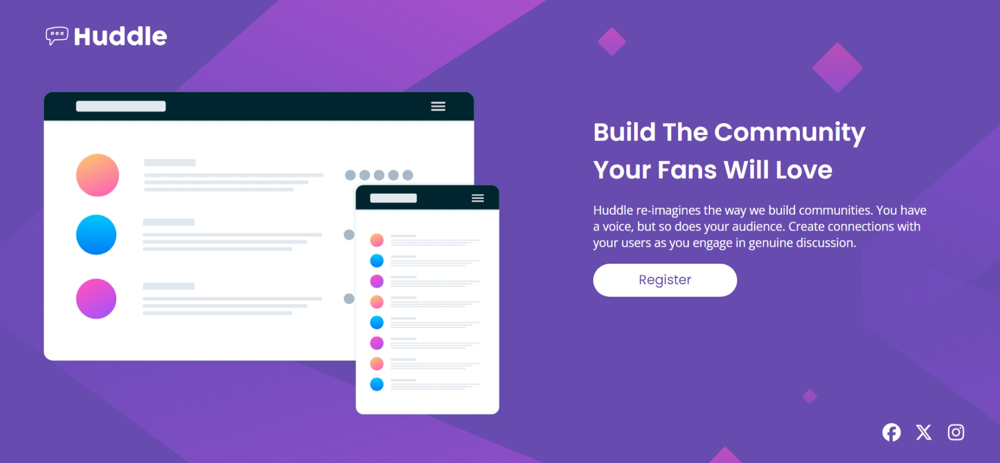

### Screenshots

### Live Site

- [Live Site URL](https://your-live-site-url.com)

### Built with

- HTML5 
- CSS
  - Flexbox
  - CSS Grid

### What I learned

I learned using the CSS Grid for the page layout along with the flexbox for inner components.

### Continued development

Responsive design needs to be maintained in addition to semantics and accessibility. I'm planning to maintain these in the future Insha'Allah.

### Useful resources

- [Font Awesome](https://fontawesome.com/) - This website helped me find high quality social media icons and even had a built-in color picker to change the colors of the icons, in addition to other options such as rotating the icon.

